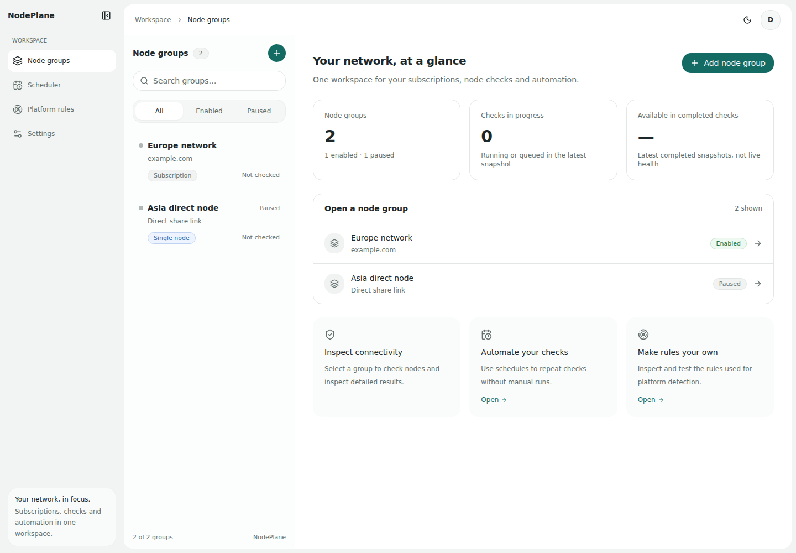
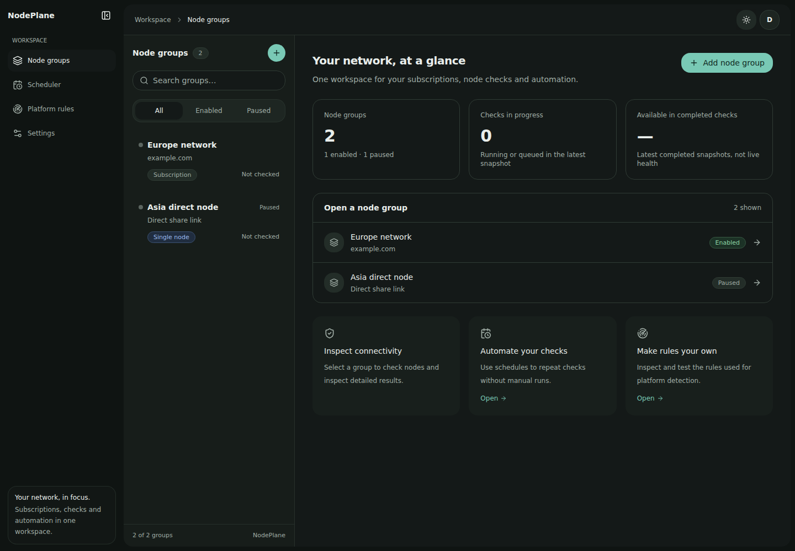
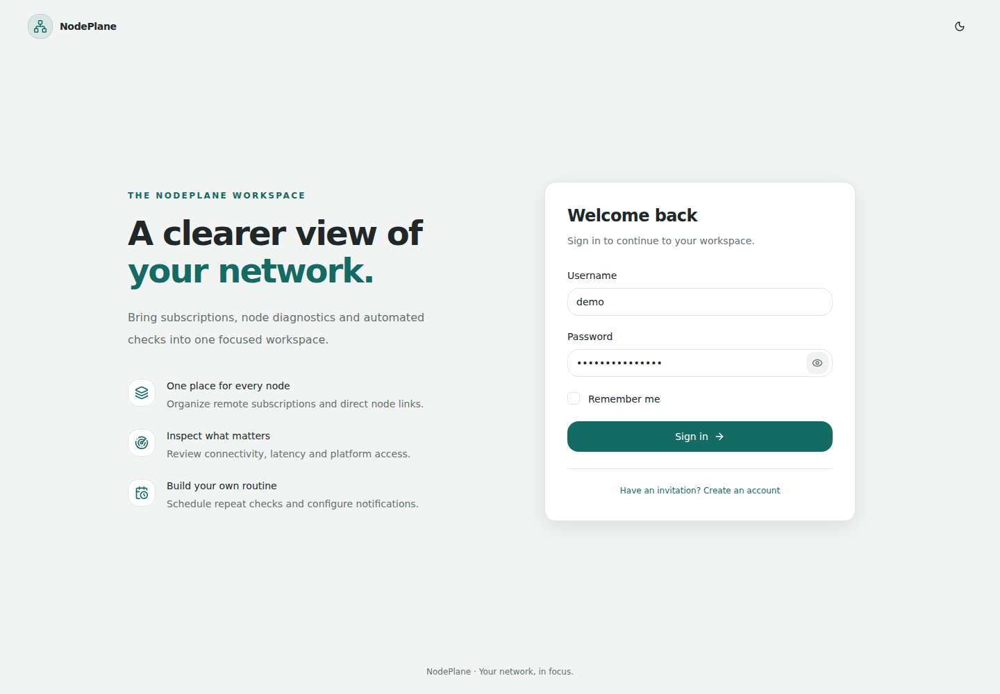
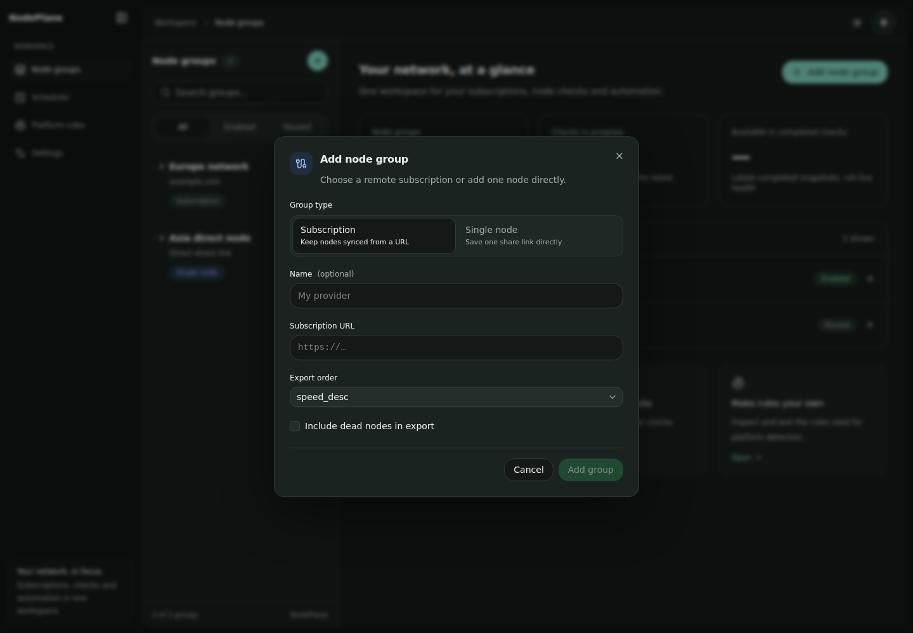
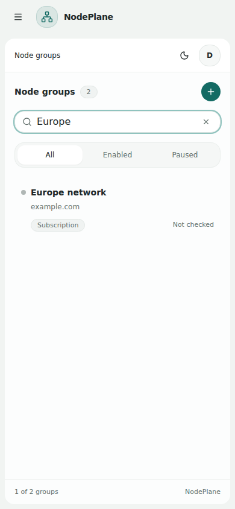
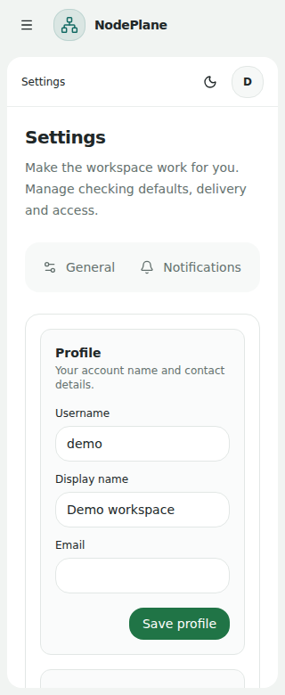

# NodePlane

一个可以自托管的代理节点管理与检测工作台。集中管理订阅和单节点，检查可用性、延迟、下载/上传速度与平台解锁状态，并通过计划任务、通知和导出链接连接日常使用流程。

前端采用 React 19、TanStack Start 和 [Asharca UI](https://asharca.github.io/ui/)，后端采用 Go、Encore 和 mihomo。UI 组件以源码形式存放在仓库中，可以直接修改，不依赖一个不存在的 `@asharca/ui` npm 包。

[界面预览](#界面预览) · [主要功能](#主要功能) · [本地开发](#本地开发) · [测试](#测试) · [自托管](#自托管) · [项目结构](#项目结构)

## 界面预览

下面的截图由本项目的浏览器测试生成，**使用虚构的演示账户和测试数据**，不代表真实节点速度、在线率或生产环境状态。图片保存在 `docs/screenshots/`，不依赖会过期的 CI 附件链接。

### 节点工作台 · 浅色



### 节点工作台 · 深色



<details>
<summary>登录页面与新建节点分组</summary>





</details>

<details>
<summary>移动端与窄屏设置页面</summary>

<p>
  
  
</p>

</details>

## 主要功能

| 模块 | 能力 |
| --- | --- |
| 节点管理 | 远程订阅分组、单节点分享链接、节点导入、追加单节点、从 URL 刷新、抓取试运行、通过已有节点抓取订阅、启用/停用与搜索筛选。 |
| 节点检测 | 可用性、延迟、下载/上传测速；全组或选中节点检测；SSE 实时进度、取消运行、历史结果、调试记录。未执行的检测项目可继承已有结果。 |
| 平台规则 | 内置平台规则，以及 Condition、JavaScript、TypeScript、Tengo、Lua 五种规则类型；编辑、测试、启停与恢复内置定义；支持选择代理节点进行测试。 |
| 自动化 | Cron 定时检测、检测参数配置、任务启停和删除。订阅分组支持计划任务，单节点分组不支持。 |
| 通知 | Webhook、Telegram、SMTP 邮件；检测报告、平台告警和定时网络解锁报告；提供通知渠道测试入口。 |
| 导出 | 单组或全部节点导出；Clash、Base64 和 RouterOS 格式；独立 API 密钥、密钥轮换、导出排序、失效节点选项、国家/速度/平台标签及请求日志。不同导出格式的协议支持范围并不相同。 |
| 账户与界面 | 邀请码注册、登录及保持登录、资料和密码修改；明暗主题、可折叠桌面侧栏、手机抽屉导航和响应式布局。 |

节点协议能力来自 mihomo；某个协议可以导入，不等于所有导出格式都能保留其全部字段。平台检测结果也会受到出口 IP、目标平台策略和检测规则变化的影响。

## 本地开发

### 环境

- Go：遵循根目录 `go.mod`（当前为 `1.26.1`）。
- Encore CLI 和可正常运行的 Docker：Encore 在本地管理 PostgreSQL 等基础设施。
- Node.js 24 和 Bun `1.3.10`：与前端 CI 保持一致。

首次使用 Encore 可参考[官方安装文档](https://encore.dev/docs/go/install)。

```bash
git clone https://github.com/asharca/NodePlane.git
cd NodePlane
```

仓库中的 `encore.app` 包含维护者的应用 ID。独立本地开发或测试时，可以先备份，再移除本地副本中的 `id`，保留其他配置；**不要把个人的 Encore 应用 ID 或密钥提交进仓库**。完全独立的本地副本也可以使用 `{}` 作为 `encore.app`。

在项目根目录创建 `secrets.local.cue`，设置只供本机使用的随机密钥：

```cue
JWTSecret: "replace-with-a-long-random-local-secret"
```

后端需要的字段名是 `JWTSecret`。部署配置则通过 `JWT_SECRET` 环境变量注入这一字段，二者不要混淆。

### 启动后端

```bash
# 每次启动都使用你自己的邀请码；生产环境不要使用代码里的默认值。
export REGISTER_INVITE_CODE='replace-with-your-invite-code'
encore run --port 4000
```

### 启动前端

另开一个终端：

```bash
cd NodePlane/frontend
bun install --frozen-lockfile
bun run dev
```

前端开发端口为 **3001**。浏览器访问 `http://localhost:3001`，前端通过同源 `/api/*` 转发请求给后端，默认后端地址为 `http://localhost:4000`。需要其他后端时设置 `ENCORE_URL`。

首次进入后，使用上面设置的邀请码注册账户；然后添加订阅分组或单节点，配置检测 URL，运行检测。不要将自己的订阅令牌或代理凭据放进公开截图和 issue。

### 构建前端

```bash
cd frontend
bun run check-types
bun run test:unit
bun run build
ENCORE_URL=http://localhost:4000 bun run start
```

生产构建由 Nitro 输出到 `frontend/.output/`，不是仅部署一份静态 `dist/`。前端 API 客户端 `src/lib/client.gen.ts` 和路由文件 `src/routeTree.gen.ts` 为生成文件，不要手工修改。

## 测试

测试分层运行，避免把“模拟数据页面能打开”当成真实功能验证。

| 层次 | 执行内容 | 入口 |
| --- | --- | --- |
| Go 回归 | 业务逻辑、解析/导出、规则、事件与数据库相关回归。 | `encore test -v -count=1 ./...` |
| 前端单元/组件 | 筛选、Cron、检测参数、SSE 状态、表单和 Asharca 适配器交互。 | `cd frontend && bun run test:unit` |
| 真实 HTTP 功能 | 注册登录、数据持久化、节点与订阅、检测与取消、计划任务、规则、导出、通知、跨用户隔离等。使用真实 Encore 服务和 PostgreSQL。 | `tests/functional_api.py` |
| 浏览器功能 | 真实页面操作经 `/api` 代理调用真实后端，并核对请求和保存后的状态。 | `frontend/scripts/functional-browser.mjs` |
| UI 视觉冒烟 | 明暗主题、响应式布局、导航、错误/空状态及 README 截图。此层使用模拟 API。 | `frontend/scripts/ui-smoke.mjs` |
| 容器发布回归 | 镜像命名与标签、Compose 引用、真实前后端镜像构建和前端容器 `/login` 启动验证；PR 不推送或部署。 | `tests/test_image_metadata.py`、`.github/workflows/deploy.yml` |

详细启动方式、覆盖矩阵、报告位置及边界见 [功能测试说明](docs/testing.md)。GitHub Actions 分别执行前端检查和后端/浏览器功能测试，失败时上传诊断报告。

**真实 API 测试只能对一次性测试实例运行。** 它会创建账户、订阅、节点、任务和通知配置。脚本要求 `NODEPLANE_E2E_DISPOSABLE=1`，并拒绝非 loopback 地址。结束后销毁整个测试实例，不要指向日常使用的本地数据库，更不要指向生产环境。

外部订阅、HTTP 代理、测速目标、Webhook 和 SMTP 使用本地可控测试服务。它们验证本项目的执行链路，不替代真实运营商网络、商业平台解锁、Telegram 云服务或生产邮件服务的现场验收。

## 自托管

### 部署前先检查配置

目前仓库的 `docker-compose.yml` 和 `deploy/infra.config.json` 包含维护者部署环境的示例值，包括数据库地址和域名；**不是复制 `.env.example` 后就能直接运行的通用一键部署模板**。

部署时至少需要完成以下配置：

1. 准备 PostgreSQL，创建 `auth`、`subscription`、`checker`、`scheduler`、`notify`、`settings` 六个数据库，配置专用数据库账户和访问权限。
2. 同步修改 Compose 的 migrator 数据库地址与 `deploy/infra.config.json` 中的 SQL 主机、TLS、metadata/base URL；配置 NSQ。运行数据库迁移前先备份现有数据。
3. 构建或选择与你部署分支对应的后端/前端镜像。Compose 默认使用 `ghcr.io/asharca/nodeplane` 和 `ghcr.io/asharca/nodeplane-frontend`；确认对应版本已成功发布。通过 `NODEPLANE_IMAGE_PREFIX` 指定其他仓库前缀，使用 `SUBS_CHECK_IMAGE_TAG` 同时固定两个服务的版本。
4. 配置随机的 `JWT_SECRET`、`DB_USER`、`DB_PASSWORD`，并将 `REGISTER_INVITE_CODE` 明确传入 backend 容器。确认前端 `ENCORE_URL` 指向 backend 服务。
5. 在反向代理上启用 HTTPS，妥善保管订阅、代理和导出密钥。验证 SSE 长连接、数据库连接、导出及通知后再对外开放。

镜像仓库路径必须为小写；工作流通过 `.github/scripts/image-metadata.sh` 统一处理 owner/repository，发布标签保留原大小写。`main` 发布完整提交 SHA 与 `latest`，版本标签发布完整 SHA 与对应版本标签。PR 仅构建、检查容器，不登录 GHCR、不推镜像、不触发 Coolify。工作流成功触发 Coolify 不等于线上健康检查通过；仍需检查实际部署状态。

已有 Coolify 应用若使用独立维护的 Compose 或固定镜像地址，也需要同步镜像前缀。需要暂时继续使用历史仓库时，可设置 `NODEPLANE_IMAGE_PREFIX=ghcr.io/renhedata/subs-check-re`；这不会把新代码发布到历史仓库。

示例构建命令：

```bash
# 从根目录构建后端；先按实际部署环境调整 infra.config.json。
encore build docker --config deploy/infra.config.json nodeplane-backend:local

# 构建包含 Nitro 服务的前端镜像。
docker build -t nodeplane-frontend:local ./frontend
```

### 单实例约束

**当前 checker/scheduler 后端应以单实例运行。** 实时任务总线和 Cron 注册使用进程内状态；启动恢复还会处理遗留运行任务。不要直接通过增加 backend 副本数实现扩容，否则会产生调度和任务状态冲突。见 [ADR：单实例部署](docs/adr/0001-single-instance-deployment.md)。

API 中标记为公开的流式进度端点与密钥导出端点具有独立的访问方式；不能将“其他 API 需要登录”理解为所有公开端点都经过相同的 Bearer 鉴权。

## 项目结构

```text
NodePlane/
├── frontend/
│   ├── src/
│   │   ├── components/asharca/  Asharca UI 源码与许可
│   │   ├── components/workbench/ 节点工作台
│   │   ├── components/platforms/ 规则编辑与调试
│   │   ├── routes/              文件路由与设置页面
│   │   ├── queries/             TanStack Query 数据交互
│   │   └── lib/                 API 客户端及前端工具
│   ├── server/routes/api/       同源后端代理
│   ├── scripts/                 浏览器测试
│   └── docs/                    UI 接入与验证说明
├── services/
│   ├── auth/                    注册、登录与账户
│   ├── subscription/            订阅和节点分组
│   ├── checker/                 节点检测、规则、进度与导出
│   ├── scheduler/               定时检测任务
│   ├── notify/                  通知与报告
│   └── settings/                用户设置与导出密钥
├── tests/                       真实 API 功能测试及外部服务夹具
├── docs/                        测试文档、架构决策、页面截图
├── deploy/                      部署基础设施与迁移脚本
└── .github/workflows/            构建与测试流程
```

## UI 与贡献

Asharca UI 的来源版本、MIT 许可及为现有 Base UI 接口保留的适配方式，见 [UI 接入说明](frontend/docs/ui-integration.md)。组件许可证只说明对应组件的授权，不自动代表整个仓库采用相同许可证。

提交修改前运行相关测试；新增用户功能应包含成功、失败、权限和持久化用例。修改 API 后重新生成客户端，修改 UI 后同时检查浅色、深色和窄屏。截图更新必须使用测试数据，不能暴露真实账户、订阅地址或密钥。
